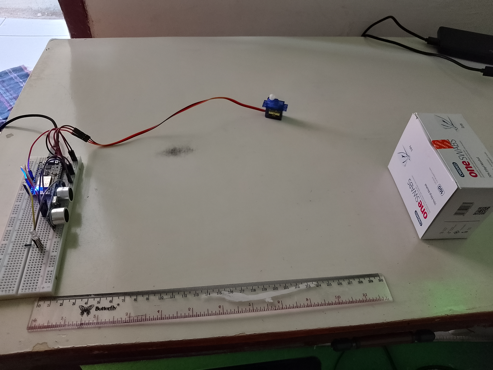

# SecureVault - Security Sensors In The Delivery Of Goods Based On The Internet Of Things

Goods distribution activities are one of the activities that are often carried out to channel production goods from warehouses to consumers. CV Pesen Apa Aja is a partner engaged in a coffee shop or a coffee shop is a place of business that sells a variety of cold drinks with snacks. No wonder this business partner sends inventory items in the warehouse that will be distributed to each store using a box car to deliver the goods needed by each store.

This box car is the main actor in shipping goods or (Purchase Orders). The process of shipping goods that will be distributed to each branch of the existing store begins with taking the goods to the central warehouse and then the box car will move to bring goods to order each store.
At this time the problems that occur in the box car driven by The Courier must open the door of the car and record the delivery using paper so it is quite time-consuming if there is an error in the delivery of goods. Then the IoT is made so that data can be viewed in real-time so that there are no errors or omissions in delivering goods and more effective recording.

## Members

- Ahmad Ridlo Suhardi
- Corneza Nabetha Nuril Izza Hadne
- Muhammad Akita Jabbar Razzaq
- Novelya Asis Solikha
- Rian Nura Ari Sucipto
- Susanti
- Venina Yuliya

## Prototype

Attached tools

- ESP8266
- Male to male cable
- Resistor
- LED
- 9G Servo
- HC-SR04 Ultrasonic Sensor
- Breadboard

## Supporting Applications

The device has a support application that can be used to find out the activities that occur while the device is in use. In addition, this application can also change the configuration of distance measurement as needed.

Currently, the app is only built for the Android platform with a minimum requirement of **Android 6.0 (Marshmallow)**. Other platforms can access the [SecureVault Link Web](https://iot-keamanan-barang.web.app/ "SecureVault Link Web App") page.

The application can be downloaded [here](https://drive.google.com/drive/folders/1uczK627XlBHWBdQQPxO1swF5Vvvbh7GT?usp=drive_link "SecureVault Link App - Google Drive").

## Demonstration

Here is a [video demonstration](https://drive.google.com/file/d/1lTBTteJKyi-9-B32qyXHckIX0P64_SH4/view?usp=sharing) of the use of the device.

## The Library Used In This Project

- [Servo](https://github.com/arduino-libraries/Servo "Servo Library for Arduino")
- [NTPClient](https://github.com/arduino-libraries/NTPClient "NTPClient")
- [Firebase ESP Client](https://github.com/mobizt/Firebase-ESP-Client "Firebase Arduino Client Library for ESP8266, ESP32 and RP2040 Pico")
